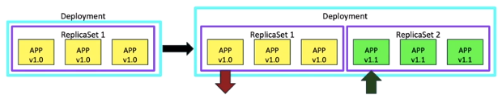

# DevOps TOTAL, Docker, Kubernetes, Jenkins, AWS, Git y More

[DevOps TOTAL Docker, Kubernetes, Jenkins, AWS, Git y Más!](https://www.udemy.com/course/devops-total/?couponCode=KEEPLEARNING)

## Seccion 3: Requisitos previos (Informacion y Configuracion)

### Herramientas de Windows

Instalar chocolatey desde las instrucciones dadas en este [Link](https://chocolatey.org/install).

Ejecutar todos los comandos a continuación en Powershell (Abrir Powershell como Administrador)

```cosole
choco install virtualbox

choco install vagrant

choco install git

choco install jdk8

choco install maven

choco install awscli

choco install intellijidea-community

choco install sublimetext3.app
```

### Herramientas para Ubuntu

Install Virtualbox

```cosole
sudo apt update
sudo apt install virtualbox
```

Install Vagrant

```cosole
curl -O https://releases.hashicorp.com/vagrant/2.2.9/vagrant_2.2.9_x86_64.deb
sudo apt install ./vagrant_2.2.9_x86_64.deb
```

Install Git

```cosole
apt install git
```

Install jdk8

```cosole
sudo apt-get install openjdk-8-jdk
```

Install Maven

```cosole
sudo apt-get install maven
```

Install awscli

```cosole
sudo apt-get install awscli
```

Install Intellij community

```cosole
sudo snap install intellij-idea-community --classic
```

Install Sublime Text

```cosole
sudo apt update
sudo apt install dirmngr gnupg apt-transport-https ca-certificates software-properties-common
curl -fsSL https://download.sublimetext.com/sublimehq-pub.gpg | sudo apt-key add -
sudo add-apt-repository "deb https://download.sublimetext.com/ apt/stable/"
sudo apt install sublime-text
```

## Seccion 4: Maquina virtual, Vagrant y Servidores

### Virtualizacion

Permite crear multiple computadoras logicas en un mismo disposi6tivo fisico.

- Host OS: sistema operativo de la maquina fisica.
- Gueste OS: sistema operativo de la maquina virtual.
- VM: maquina virtual
- Snapshot: BackUp d ela maquina virtual
- Hypervisor: habilita la virtualizacion y permite la creacion de VM. Tipo 1 o Bare metal que correo como OS y solo se usa para produccion. Tipo 2 que corre como software, solo es para aprendizaje y testeo.

### Configuracion de VM's con Vagrant (Automatizacion)

- Encontrar nombre para Box en la nube vagrant (vagrant cloud). Por ejemplo, "geerlingguy/centos7".
- Crear un directorio de proyectos (una carpeta)
- Crear Vagranfile en el directorio de proyectos `vagrant init geerlingguy/centos7`
- Comandos de Vagrant como `vagrant up`
- Iniciar sesion con `vagrant ssh` para las VMs de Linux

Para apagar la VM `vagrant halt`
Para borrar la VM `vagrant destroy`
para reiniciar la VM `vagrant reload`

**Configuracion de red:**
Red privada `config.vm.network "private_network", ip: "192.168.33.10"`
Red publica o nat `config.vm.network "public_network"`

#### Carpeta compartida o de sincronizacion

Tener encvuenta que todo lo que tengamos en el directorio de trabajo en el host, se vera en lamcarpeta *vagrant* en el guest.

Para crear la carpeta de sincronizacion, añadir `config.vm.synced_folder "F:\\vagrant-vms\\shellsscripts", "/vagrant_data"`en el vagrantfile, donde se especifica la ruta host y la ruta en el guest.

Para acceder a la carpeta de sincronizacion, ejecutar `cd /vagrant_data` en el guest, se observara todo lo que este en *F:\\vagrant-vms\\shellsscripts*.

#### Aprovicionamiento en Vagrant

Colocar los comandos que queramos dentro de los dos SHELL y luego ejecutar `vagrant reload --provision`

```cosole
config.vm.provision "shell", inline: <<-SHELL
     yum install httpd wget unzip -y
     mkdir /opt/devopsdir
     free -m
     uptime
   SHELL
```

#### Administracion de servidores

Instalar los paquetes HTTPD, wget y unzip

##### HTTPD

```cosole
yum install httpd wget unzip
```

Habilitar httpd. Una vez habilitado se podra acceder a la pagina por defecto en el navegador mediante la ip privada.

```cosole
systemctl start httpd
systemctl enable httpd
```

Si queremos crear una nueva pagina web debemos colocar todos los archivos en */var/www/html*. Para esto podemos usar los comandos wget, unzip si tenemos un template en internet para descargar, el link de descarga se optiene en la pestaña de red de la herramientas de desarrollador.

##### WordPress

Instalar dependencias y wordpress siguienedo el siguiente [Link](https://ubuntu.com/tutorials/install-and-configure-wordpress#1-overview)

#### Varias VM con un solo Vagrantfile

Configuracion de ejemplo para dos VMs en un solo Vagrantfile, parea mayor informacion ver la [Documentacion de Vagrant](https://developer.hashicorp.com/vagrant/docs/multi-machine)

```cosole
Vagrant.configure("2") do |config|
    config.vm.provision "shell", inline: "echo Hello"
  
    config.vm.define "web01" do |web01|
        web01.vm.box = "ubuntu/bionic64"
        web01.vm.network "private_network", ip: "192.168.33.50"
        web01.vm.provider "virtualbox" do |vb|
          vb.memory = "1024"
          vb.cpus = 2
        end

        web01.vm.provision "shell", inline: <<-SHELL
            apt update
            apt install apache2 wget unzip -y
            systemctl start apache2
            systemctl enable apache2
            cd /tmp/
            wget https://www.tooplate.com/zip-templates/2108_dashboard.zip
            unzip -o 2108_dashboard.zip
            cp -r 2108_dashboard/* /var/www/html/
            systemctl restart apache2
        SHELL
    end
  
    config.vm.define "db01" do |db01|
        db01.vm.box = "centos/7"
        db01.vm.network "private_network", ip: "192.168.33.51"
        db01.vm.provider "virtualbox" do |vb|
          vb.memory = "1024"
          vb.cpus = 2
        end

        db01.vm.provision "shell", inline: <<-SHELL
            yum install mariadb-server -y
            systemctl start mariadb
            systemctl enable mariadb

            sudo mysql -u root -e 'CREATE DATABASE wordpress;'
            sudo mysql -u root -e 'CREATE USER wordpress@localhost IDENTIFIED BY "root";'
            sudo mysql -u root -e 'GRANT SELECT,INSERT,UPDATE,DELETE,CREATE,DROP,ALTER ON wordpress.* TO wordpress@localhost;'
            sudo mysql -u root -e 'FLUSH PRIVILEGES;'
        SHELL
    end
  end
```

para ejecutar comandos a una VM debemos especificar el nombre de la VM, por ejemplo:

```cosole
vagrant destroy web01
vagrant ssh web01
vagarn reload web01
```

## Seccion 5: Git & GitHub - Redes

- [Comandos windows](https://openwebinars.net/blog/20-comandos-de-red-mas-importantes-en-windows/)
- [Comandos ubuntu](https://aprenderlinux.org/los-20-principales-comandos-de-red-de-linux/)

## Seccion 6: Git & GitHub - Principios basicos

`git init` iniciar git.

`git status` estado de git

`git add file1`, `git add .` o `git add -A` agrega archivos al area de preparacion.

`git commit file1 -m "Descripcion"` o `git commit -m "Descripcion"` agrega cambios al repositorio local.

`git log` muestra historial de commits.

`git log --all` muestra todo el historial de commits.

`git log --graph` muestra todo el historial de commits graficamente.

`git log --oneline` muestra historial de commits en una linea.

`git log --merged` ver ramas fusionadas.

`git log --no-merged` ver ramas  no fusionadas.

`git remote add origin url_https` agrega repositorio remoto por https.

`git remote add origin url_ssh` agrega repositorio remoto por ssh.

`git diff` muestra cambios realizados

### Ramificacion y fusion

`git branch nombre_rama` Crear una rama.

`git switch nombre_rama` o `git checkout nombre_rama` cambiar de rama.

`git merge nombre_rama` fusiona los cambios de la rama *nombre_rama* a la rama actual.

`git branch -d nombre_rama` elimina una rama.

`git branch nombre_rama2 nombre_rama1` crea una nueva rama *nombre_rama2* a partir de *nombre_rama1* pero el head se queda en la rama donde se hizo el comando.

### Clonar, Fusionar y Sincronizar

`git clone url_repositorio` clona un repositorio remoto.

`git branch -r` ver ramas del repositorio remoto.

`git fetch origin` sincroniza el repositorio local con el remoto.

`git pull origin nombre_rama_remota` trae los datros de la rama *nombre_rama_remota* a la rama local.

`git branch -M nuevo_nombre` renombra la rama *master* a *main*.

### Explorando el Historial y los Commits

**Git Graph** es una extencion de VS para ver las ramas visualmente

`git show id_commit` muestra los detalles de un commit.

`git show id_commit:nombre_archivo` muestra los detalles de un archivo en un determinado commit.

`git log --oneline --all -stat` muestra los archivos modificados.

`git ls-tree id_commit` muestra los nombre de los archivos en un determinado commit.

`rm file1` y `git add .` es igual a `git rm file1`

### Fork

- Hacer Fork repositorio, lo que crea un nuevpo repositorio en tu cuenta
- Hacer clone al repositorio creado en tu cuenta
- Hacer modificaciones
- Hacer push al repositorio en tu cuenta
- Hacer pull request
- Esperar que el propietario del repositorio original verifique los cambios y acepte el pull request

Si el repositorio  original esta por delante de tu repositorio en tu cuante:

- Clickear la opcion *Sunc fork* para fucionar los cambios. Para tener los cambios localmente hacer `git pull`.

- `git remote add upstream url_repositorio_principal`, `git fetch upstream`, nos movemos a la rama local deseada `git switch main`, hacemos merge `git merge upstream/main`, actualizamos nuestro repositorio forkeado `git push origin`.

### Gitignore

Crear archivo *.gitignore* y colocar lo que quremos ignorar en git:

- log\
- log\file.txt
- *.xslx
- file.xslx

### Issues

Para mandar solicitudes de modificacion a laos colaboradores del proyecto.

### Integraciones

Existe integraciones con Discord y Jenkins.

### GitFlow


## Secsion 10: Docker - Teoria General e Introduccion

No se puede ejecutar un Contenedor si este tiene un Kernel diferente al Host.

- DockerHub: repositorio de imagenes
- imagen: plantilla para crear contenedores

### Instalar ubuntu y acceder con ssh

```console
sudo apt-get install ssh
sudo apt install nmap
sudo apt install net-tools
ifconfig
sudo nmap <ip del pc>
```

Si no funciona ssh instalar `openssh-server`.

### conectarse mediante ssh

```console
ssh -p 22 user@ip
```

### Instalacion de docker en ubuntu

Seguir la documentacion de docker para instalar ubuntu siguiendo el siguiente [Link](https://docs.docker.com/engine/install/ubuntu/)

```console
# Desistalar versiones de Docker existentes:
for pkg in docker.io docker-doc docker-compose docker-compose-v2 podman-docker containerd runc; do sudo apt-get remove $pkg; done

# Add Docker's official GPG key:
sudo apt-get update
sudo apt-get install ca-certificates curl
sudo install -m 0755 -d /etc/apt/keyrings
sudo curl -fsSL https://download.docker.com/linux/ubuntu/gpg -o /etc/apt/keyrings/docker.asc
sudo chmod a+r /etc/apt/keyrings/docker.asc

# Add the repository to Apt sources:
echo \
  "deb [arch=$(dpkg --print-architecture) signed-by=/etc/apt/keyrings/docker.asc] https://download.docker.com/linux/ubuntu \
  $(. /etc/os-release && echo "$VERSION_CODENAME") stable" | \
  sudo tee /etc/apt/sources.list.d/docker.list > /dev/null
sudo apt-get update

# Install the Docker packages:
sudo apt-get install docker-ce docker-ce-cli containerd.io docker-buildx-plugin docker-compose-plugin

# Verify that the Docker Engine installation:
sudo docker run hello-world
```

## Secsion 11: Docker - Windows

### Instalacion de docker en windows

Seguir el suguiente tutorial de [Docker Docs](https://docs.docker.com/desktop)

## Seccion 12: Docker - Comandos

- `docker run <nombre de la imagen>` ejecuta un contenedor ya sea localmente o de docker hub.
- `docker ps` lista los contenedores en funcionamiento.
- `docker ps -a` lista los contenedores en y no funcionamiento.
- `docker stop <id o nombre del contendor>` Detiene el contenedor.
- `docker rm <id o nombre del contendor>` elimina permanentemente un contenedor detenido o en salida. Se pueden eliminar varios si colocamos varios en la lista.
- `docker images` lista todas la simagenes disponibles.
- `docker pull <nombre de la imagen>` descarga una imagen de docker hub para luego poderla usar.
- `docker rmi <nombre de la imagen>` elimina una imagen, pero esta no debe estar utilizada por un contenedor.
- `docker exec <nombre del contenedor> <comando>` permite ejecutar un comando en el contenedor.
- `docker attach <id o nombre de docker>` adjunta de vuerlta al contenedor en ejecucion.

## Seccion 13: Docker - Comando Run

### Docker run

- `docker run <nombre de la imagen>` ejecuta un contenedor ya sea localmente o de docker hub.
- `docker run <Nombre de la imagen>:<version>` ejecura una imagen con una version determinada, la version por defecto es *latest*.
- `docker run ubuntu sleep 5` elcontenedor se manteine en suspencion por 5 segundos y luego se cierra.
- `docker run CursoDockerr/appweb` ejecuta una imagen personalizada para una apk web, se ejecuta en primer plano o de forma adjunta y estara conectado a la consola o por fuera del contenedor docker pudiendo ver la salida.
- `docker run -d CursoDockerr/appweb` ejecuta en el backend una imagen personalizada para una apk web.
- Banderas despues del run:
  - `-i` bandera para correr un contenedor en modo interactivo.
  - `-t` bandera para conectarse a la terminal del contenedor.
  - `-d` bandera para correr un contenedor en el bacground.
- `docker run --CPUS=.5 --memory=100m ubuntu` limita el numero de cpus y memoria usados por el contenedor.

### Mapeo de puertos

- `docker run -p <puerto del host de docker>:<puerto del contenedor de docker> CursoJenkis0/appweb`, el usuario podra acceder a la palicacion en la URL `http://<ip del contenedor>:<puerto del host de docker>`. El `<puerto del host de docker>` debe estar libre.

### Datos en Docker

- `docker run -v <directorio del host>:<directorio del contenedor>` configura un volumen en un contenedor. Por ejemplo, `docker run -v /opt/datadir:/var/lib/mysql mysql` guarda el contendido  **/var/lib/mysql mysql** en el volumen exterior **/opt/datadir**.

- `docker inspect <nombre o id del contenedor>` permite inspeccionar un contenedor.

- `docker logs <id o nombre del contenedor>` permite ver los registros de un contenedor ejecutado en segundo plano.

## Seccion 14: Docker - Imagenes

### Crear una imagen

Pasos para crear una imagen de una App web de forma manual:

- Comenzar con un sistema operativo como Ubuntu
- Actualizar los repositorios de origen con el comando apt
- Instalar dependecias con el comando apt
- Instalar dependencias de python usando el comando pip
- Copiar el codigo fuente de mi aplicacion a una ubicacion como una carpeta apt
- ejecutar el servidor web usando el comando flask

Se crea un archivo de docker llamado **dockerfile** y escribimos las intruciones para configurar la app.

`docker build . -f Dockerfile -t CursoDockerr/my-custom-app` construye una image a partir del Dockerfile.

`docker tag ubuntu:platzi edierbra/ubuntu:platzi` cambia el tag a una imagen.

`docker push Cursodockerr/my-custom-app` Publica el contenedor en docker Hub. Tener encuenta que antes se debe iniciar sesion con `docker login`

Estructura del dockerfile:

- `FROM` define el sistema operativo del contenedor.
- `RUN` indica comandos en particular que se deben ejecutar en la imagen base.
- `COPY` copia los archivos locales al contenedor.
- `ENTRYPOINT` permite especificar un comando a ejecutar cuando la imagen se ejecute como un contenedor.

`docker history Cursodockerr/my-custom-app` para observar los detalles al construir una imagen con dockerfile.

Al construir la imagen se podran ver las capas, si hay un error docker no construye todo de nuevo, sino desde la capa que ocurrio el error.

## Seccion 15: Docker - Compose y Registros

Ejemplo apk de votacion:

- `docker build . -t voting-app` construir la imagen de el frontend.
- `docker run -d --name redis redis` ejecutar un contendor de redis para la db.
- `docker run -d --name=db -e POSTGRES_PASSWORD=postgres -e POSTGRES_USER=postgres postgres:9.4` ejecutar el contenedor de postgress.
- `docker run -p 5000:80 --link redis:redis voting-app` construir el contenedor del frontend y enlazarlo con redis.

Ejemplo apk de resultados de la apk de votacion:

- `docker build . -t worker-app` construir la imagen worker-app
- `docker run --link redis:redis --link db:db worker-app` construir el contenedor worker-app y enlazarlo con redis y db.
- `docker build . -t result-app`construir la imagen del frontend de la apk de resultados.
- `docker run -p 5001:80 --link db:db result-app`ejecutar la imagen del frontend de resultados y enlazarlo con db.

### Docker Compose

Ejemplo simple:

```console
version: '3'

services:
  redis:
    image: redis

  db:
    image: postgres:9.4
    environment:
      POSTGRES_USER: "postgres"
      POSTGRES_PASSWORD: "postgres"

  vote:
    image: voting-app
    ports:
      - "5000:80"
    links:
      - redis

  worker:
    image: worker-app
    links:
      - redis
      - db

  result:
    image: result-app
    ports:
      - "5001:80"
    links:
      - db
```

Ejemplo completo:

```console
# version is now using "compose spec"
# v2 and v3 are now combined!
# docker-compose v1.27+ required

services:
  vote:
    build: ./vote
    # use python rather than gunicorn for local dev
    command: python app.py
    depends_on:
      redis:
        condition: service_healthy
    volumes:
     - ./vote:/app
    ports:
      - "5000:80"
    networks:
      - front-tier
      - back-tier

  result:
    build: ./result
    # use nodemon rather than node for local dev
    command: nodemon server.js
    depends_on:
      db:
        condition: service_healthy
    volumes:
      - ./result:/app
    ports:
      - "5001:80"
      - "5858:5858"
    networks:
      - front-tier
      - back-tier

  worker:
    build:
      context: ./worker
    depends_on:
      redis:
        condition: service_healthy
      db:
        condition: service_healthy
    networks:
      - back-tier

  redis:
    image: redis:5.0-alpine3.10
    volumes:
      - "./healthchecks:/healthchecks"
    healthcheck:
      test: /healthchecks/redis.sh
      interval: "5s"
    ports: ["6379"]
    networks:
      - back-tier

  db:
    image: postgres:9.4
    environment:
      POSTGRES_USER: "postgres"
      POSTGRES_PASSWORD: "postgres"
    volumes:
      - "db-data:/var/lib/postgresql/data"
      - "./healthchecks:/healthchecks"
    healthcheck:
      test: /healthchecks/postgres.sh
      interval: "5s"
    networks:
      - back-tier

volumes:
  db-data:

networks:
  front-tier:
  back-tier:
```

## Seccion 17: Docker - Servicio de almacenamiento

Estructura de almacenamiento:

- var/lib/docker
  - ausf
  - contenedores
  - imagenes
  - volumenes

Como las imagenes estan conformadas por capas, las capas se pueden reutilizar en otras imagenes. Los controladores de almacenamiento gestionan las capas, algunas de los controladores son: AUSF, ZF, BTRFS, DEVICE MAPPER, OVERLAY Y OVERLAY 2.

- `docker colume create date_volume` crea un volumen.
- `docker run -v data_volume:var/lib/mysql mysql` (Metodo anticuado) guardar los datos del contenedor en el volumen creado, y asi no perderlos cuando se elimine el contenedor. Si no se crea el volumen anteriormente, docker lo creara automaticamente. **data_volume** puede ser un montaje de union, es decir guardar los datos en otro directorio.
- `docker run / --mount type=bind, source=/data/mysql, target=/var/lib/mysql mysql`

## Seccion 18: Docker - Redes

Al instalar Docker  se crean 3 redes iniciales: BRIDGE, HOST, NONE

El servidor DNS de docker esta en la direcion 127.0.0.11 y auda a los contenedores acceder a los unos con los otros a partir de el nombre del contenedor, por lo que la direcion ip de cada contenedor puede cambiar. Por lo tanto, no se recomienda enlazar contenedores con su propia ip.

- `docker network ls` lista las redes creadas.
- `docker run ubuntu` simpre asocia al contenedor a la red  predeterminada **BRIDGE** (172.17.0.1).
- `docker run ubuntu --network=host` agrega al contenedo a la red host, Esto significa que el contenedor comparte la misma interfaz de red, la dirección IP y las puertas de enlace que el host. Es decir, utiliza directamente la interfaz de red del sistema host.
- `docker run ubuntu --network=host` los contenedores no estan conectados a ninguna red. estan sin acceso al exterior u otros contenedores. Es decir, estan aislados.
- `docker network create / driver bridge subnet 182.18.0.2 custom-network` crea una red llamada **custom-network**.
- `docker inspect <id o nombre del contenedor>` ver detalles del contenedor como la red a la cual esta asociado.

## Seccion 19: Docker - Orquestacion

Herramientas y guiines que pueden ayudar a alojar contenedores en un entorno de produccion. Permite equilibrio de cargas y crear instancias de acuerdo al numero de solicitudes.

- `docker service create --replicas=100 nodejs` crea 100 replicas de nodejs.

Existen varios orkestadores:

- Docker swarm:
  - Facil de configurar e iniciar.
  - No tiene funciones avanzadas de auto escalas.
  - Menor uso de recursos.
  - Pensado para los desarrolladores.
  - Seguridad desde el comienzo.
  - Mas facil de resolver cualquier problema.
- Mesos:
  - Dificil de configurar e iniciar.
  - Admite algunas opciones avanzadas.
- Kubernetes:
  - Muchos tipos de uso
  - Un poco dificil de configurar e iniciar
  - Muchas opciones para configurar el despliegue, soporte para proveedores.
  - compatible con todos los proveedores de servicios en la nube.
  - Cubre mas casos extremos que Swarm.

## Seccion 20: Docker - Swarm

### Swarm

Se deben tener varios host con docker instalado y asignar a uno de ellos cono administrador swarm y los otros como nodos trabajadores.

Configuracion:

- `docker run my-web-server` para crear el administrador swarm.
- `docker service create --replicas=3 my-web-server` para crear las instancias de nodos trabajadores. **Se debe ejecutra en el host administrador swarm.**
- `docker swarm init` en el administrador swarm.
- `docker swarm join --token <token>` en los nodos trabajadores.

## Seccion 21: Kubernetes - Introduccion y Teoria General

Utiliza los host de docker para alojar apps en forma de contenedores. Es utilizada para organizar la impementacion y administracion de miles de contenedores en un entorno en cluster.

### Conceptos basicos

- Nodos: Maquina fisica o virtual en la que un soffware de Kubernetes instala las herramientas. Es una maquina de trabajo donde se lanzan los contenedores.
- Cluster: grupo de nodos agrupados. Si un nodo falla se puede acceder a otro.
- Maestro: Nodo con los componentes del plano de kubernetes ya instalados.
  - Vigila los nodos del grupo y orquesta los contenedores de los nodos trabajadores.
  - Tiene el **servidor API**, **Scheduler o Programador**, **Controlador**, **Servicio Etcd** y **Core DNS**.
- Trabajadores o Minios: es donde se alojan los contenedores. Por ejemplo, contenedores Docker.
  - Para ejecutar estos contenedores es necesario que se instale el **runtime**, en este caso docker.
  - tienen el ajente **kubelet**, el cual interactua con el maestro para proporcionar informacion vital del nodo trabajador y llevar las acciones solicitradas por el maestro en los minions.

### Componentes basicos

- Servidor Api: frontend para kubernetes, todos se comunican con el para interactuar con el grupo de kubernetes.
- Etcd: Almacena los datos de forma distribuida (toda la informacion recopilada, valores clave). Administran el grupo e implementan los registros dentro del grupo para que no hayna conflictos entre los maestros.
- Kubelet: agente que se ejecuta en cada nodo del cluster. asegura que los contenedores esten ejecutandose correctamente en los nodos.
- Contenedor runtime: software subjacente para ejecutar contendores. Ejemplo, Docker.
- Controlador: cerebro detreas de la orquestacion. Responsable de notar y responder cuando los contenedore de nodos o puntos finales caen.
- Scheduler o Programador: distribuye en trabajo o contenedores en multiples nodos. busca contenedores recien creados y los asigna a los nodos.
- Core DNS: herramienta por defecto para controlar DNS.

### Conocimientos basicos

- Pod: es la unidad basica de implementacion o deployment en ingles. Uno o mas contenedores siendo ejecutados en conjunto en un mismo nodo. Tecnicamente se hace deployments de contenedores directamente en kubernetes, solo se hace deployments de pops y se suan cosas por env¿cima de estos, como controladores para controlar esos pods.
- Controlador: para crear o actualizar pods y otros objetos. Casi siempre creara un controlador que es un objeto para validar si lo que sucede dentro de kubernetes es lo que se le ha pedido que haga. Hay varios tipos:
  - Deployments, ReplicaSet: se usan casi siempre y controlan a los pods en los niveles mas bajos.
  - Se pueden hacer diferentes tipos de controladores, hasta de terceros: StatefulSet, DaemonSet, Job, CrobJob, etc.
- Servicio: punto final que se le da aun conjunto de pods. Cuando se usa un controlador de deployments para hacer un deployment en un conjunto de pods replica, se esta implementando un servicio. El servicion significa que le esta dando un punto final persistente en el cluster, para que todo lo demas pueda acceder a ese conjunto de pods en un nombre y puerto DNS especifico.
- Namespace: es un filtro de vista en la linea de comandos. Filtra las vistas cuando se usa la linea de comando **kubectl** y solo queremos ver ciertas cosas que nos interesan en ese preciso momento.

## Seccion 23: Kubernetes - Conceptos requeridos

### Comandos basicos

- `kubectl` comando para implementar y administarr aplicaciones en un cluster de kubernetes, obtine informacion del cluster, el estado de otros nodos del cluster, etc.
- `kubectl run`crea un pod.
- `kubectl run ngnix --image nginx`crea un pod de ngnix llamado nginx.
- `kubectl create <pod / deploiment>` crea recurso via CLIO o YAML.
- `kubectk create deployment nginx --image ngnix`crea un deploymen a partir de la version v1.18
- `kubectl delete <pod / deployment> <name del recurso a eliminar>` Elimina un pod o deployment.
- `kubectl apply` crea y actualiza sobre todo via YAML.
- `kubectl version`ver version de kubectl.
- `kubectl.
- `kubectl cluster-info`informacion de los clusters.
- `kubectl get all`lista todos los recursos del cluster
- `kubectl get nodes` lista los nodos disponibles de un cluster.
- `kubectl get pods` lista los pods disponibles de un cluster.
- `kubectl get all -o wide` **-o wide** muestra informacion adicional.
- `kubectl run my-web-app --imag`ejecuta miles de instancias de nustra aplicacion en miles de nodos.
- `kubectl run hello-minikube` despliega una aplicacion en el cluster.
- `kubectl logs pod/<nombre del pod>` ver los logs de un pod.
- `kubectl describe pods` ver info de los pods (nombre, nodo creado, labels, estado y el los contenedores y eventos).

### Comandos iniciales

- `docker run my-web-server` crear el contenedor adminsitrador.
- `kubectl run --replicas=1000 my-web-server` crea 1000 instancias de **my-web-server**.
- `kubectl run --replicas=2000 my-web-server` lo escala a 2000.
- `kubectl rolling-update my-web-server --web-server2` actualiza las instancias de forma continua y de a una.
- `kubectl rolling-update my-web-server --roll back` si algo sale mal revierte la actualizacion de las instancias.

## Seccion 24: Kubernetes - PODs y YAML

### Pods

- Los contenedores se encansulan en pods.
- Es una instancia unica en una aplicacion.
- Es el objeto mas pequeño que puedes crear en kubernetes.
- Usualmente un pod tiene un contenedor.
- No esta restringido a tener un contenedor por pod.
- Un pod puede tener multiples contenedores, usualmente son contenedores de diferente tipo.
- Para escalar la aplicacoion se necesitan crear pods adicionales.
- Si decrece el numero de usuarios, simplemente eliminamos pods.
- No se deben añadir contenedores a un pod existente para escalar la aplicacion.
- Aveces pueden haber contenedores auxiliares, los cuales hacen algun tipo de tarea de sopprte. Estos contenedores auxiliares estan en el mismo pod. Cuando se crea un contenedor de la aplicacion, se crea el auxiliar.

### Introduccion a YAML

- Kubernetes usa archivos YAML como entradas para la creacionde objetos (Pods, Replicas Sets, Deployments, servicios y mas).
- Los espacios antes de cada propiedad son importantes.
- La estructura del archivo YAML debe tener 4 campos obligatorios en el nivel superior:
  - apiVersion: version de la Api de kubernetes.
  - kind: tipo de objeto a crear.
  - metadata: datos sobre el objeto, y es un diccionario con las propiedades del objeto. Por ejemplo, name, labels.
  - spec: informacion adicional. Es un diccionario con propiedades como, containers, el cual es un array de diccionarios con propiedades name e image.

Ejemplo:

Extenciones recomendadas en visual studio: YAML, KUBERNETES SUPORT

```yml
apiVersion: v1
kind: Pod
metadata:
  name: app1-pod
  labels:
    app: app1
    type: front-end
spec:
  containers:
    - name:  nginx-container
      image:  nginx
```

[codebeautify.org](https://codebeautify.org/yaml-validator) ayuda a verificar si el archivo .yml esta bien estructurado.

- `kubectl create -f <archivo yaml>` ejecuta el archivo .yml para crear el recurso. -f indica que se debe crear el recurso con el archivo proporcionado. Podemos reemplazar **create** por **apply** y el resultado es el mismo.

## Seccion 25: Kubernetes - Replicacion controller y ReplicaSet

### Replicacion Controller

- Ejecuta varias instancias de un mismo pod en un mismo cluster de kubernetes.
- Brinda una gran disposicion de la app para que podamos acceder.
- Si tememos un solo pod y este falla, Replication controller ayuda a crear automaticamente un nuevo pod.
- Se encarga y aseguira que el numero especificado de pods se este ejecutando en todo momento.
- Balancea y Escala la aplicacion de acuerdo al numero de usuarios que quieren entrar a la aplicacion.

Ejemplo:

```yaml
apiVersion: v1

kind: ReplicationController

metadata:
  name: app1-rc
  labels:
    app: app1
    type: front-end

spec:
  template:
    metadata:
      name: app1-pod
      labels:
        app: app1
        type: front-end
        
    spec:
      containers:
        - name:  nginx-container
          image:  nginx

  replicas: 2 
```

- **template** especifica que y como debe ser la instancia que debe replicar.
- **replicas** establece la cantidad de replicas que queremos.
- `kubectl apply -f <archivo yaml>` crea o actualiza el recurso.
- `kubectl get replicationcontroller` ver los ReplicationController creados.

### ReplicaSet

- Es la forma actual que se utiliza en kubernetes para hacer lo de Replication Controller.

Ejemplo:

```yaml
apiVersion: apps/v1

kind: ReplicaSet

metadata:
  name: app1-rs
  labels:
    app: app1
    type: front-end

spec:
  template:
    metadata:
      name: app1-pod
      labels:
        app: app1
        type: front-end

    spec:
      containers:
        - name: nginx-container
          image: nginx

  replicas: 4

  selector:
    matchLabels:
      type: front-end
      app: app1
```

- **apiVersion: apps/v1** es la version para ReplicaSet.
- **selector** si tenemos muchas aplicaciones, tenemos que etiquetarlas para encontrarlas facilmente y poder filtrarlas. Ai, el selector sabe que pods buscar si hay disponibles, y si no crearlas para llegar al numero de replicas requeridas. Los labels tambien sirven para identificar los pods, y asi monitorearlos.
- `kubectl apply -f <archivo yaml>` crea o actualiza el recurso.
- `kubectl get replicaset` ver los ReplicaSet creados.
- `kubectl scale --replicas=2 -f <archivo yaml>` escala a dos replicas.

## Seccion 26: Kubernetes - Deployments

### Deployment

- brinda la capacidad de actualizar o hacer upgrade de las instancias subyacentes sin problemas usando actualizaciones continuas llamadas rolling updates, deshacer cambios, pausar, reanudar los cambios segun sea requerido.:
  - Rolling update: realiza actualizaciones de las instancias una tras otra para lograr tipempo 0 de donwtime y que no se vean afectados los usuarios.
  - Rollback: desacer los cambios recientes y volver atras .
  - Multiples cambios a la vez: en el caso de hacer varios cambios a la vez (actualizar versiones subyacentes del servidor web, escalar el entorno y mucho mas), pausamos el entorno, hacemos los cambios y reanudamos el entorno para que todos los cambios se despliguen juntos.
  - Cuando se crea un Deployment se crea un ReplicaSet, del ReplicaSet automaticamente se crean los pods requeridos.

Ejemplo:

```yml
apiVersion: apps/v1

kind: Deployment

metadata:
  name: app1-dp
  labels:
    app: app1
    type: front-end

spec:
  template:
    metadata:
      name: app1-pod
      labels:
        app: app1
        type: front-end

    spec:
      containers:
        - name: nginx-container
          image: nginx

  replicas: 5

  selector:
    matchLabels:
      type: front-end
      app: app1

```

- `kubectl apply -f <archivo yaml>` crea o actualiza el recurso.
  - `kubectl scale deploy/<name del deployment> --replicas=2` escala a 2 el deployment.

### Actualizacion de Deployment

- No olvidar colocar `--record` al crear el deployment si quiero llevar el registro de los cambios del deployment.
- `kubectl apply -f .\kubernetes\dptest.yml --record` crea el deployment y habilita el registro del cambio del deployment.
- `kubectl rollout status deploy/<nombre del deployment>` para ver el estado del rollout.
- `kubectl rollout history deploy/<nombre del deployment>` para ver el historial de rollouts.
- `kubectl set image deployment/app1-dp nginx-container=nginx:1.17.10` actualiza el contenedor **nginx-container** a la version **nginx:1.17.10** (ver el archico .yml).

Existen diferentes estrategias para el deployment:

#### Recreate

- Al realizar un deployment se hace un rollout y al hacer un nuevo rollout se crea una nueva version del deployment.
- En la estrategia Recreate, se da de baja todas la sinstancias de nuestra aplicacion a la vez, para despues crrar una nueva version de las instancias.
- Durante el periodo de recrear las nuevas instancias, la app quedara inaccesible para el usuario.
- `kubectl apply -f .\kubernetes\dptest.yml` crea el deployment.

#### rolling Update

- Una por una, las instancias se dan de baja y se actualizan a la nueva version.
- La aplicacion segira activa para el usuario mientra se relaizan los cambios.
- Al crear un  uevo deployment, se crea automaticamente un ReplicaSet. Mientras que en un ReplicaSet se destruyen los pods, emn el otro se hacen los cambios.
- `kubectl set image deployment/app1-dp nginx-container=nginx:1.17.10` actualiza el contenedor **nginx-container** a la version **nginx:1.17.10** (ver el archico .yml).



#### Rollback

- Permite deshacer los cambios realizados y volver a la version anterior.
- El deployment eliminara los pods n uevos uno por uno y volvera a traer los pods de la version anterior.
- `kubectl rollout undo deployment/<nombre del deployment>` permite volver a la version anterior.

## Seccion 27: Kubernetes - Servicios y Networking

### Servicios en Kubernetes

- Permiten la comunicacion entre varios componentes dentro y fuera de la aplicacion.
- Si necesitamos conectarnos con nuestro pod o pods, necesitamos crear un servicio.
- Nos ayudan a conectar aplicaciones con otras aplicaciones o usuarios.
- un servicio es una direccion estable para un pod o grupo de pods.
- en la practica se exponen los servicios para crear estos recursos que apuntan hacia los back-end pods.
- `kubectl expose`se usa para exponer un servicio. Tambien, se puede con un archivo **YAML** y el comando `kubectl create`.
- `kubectl get services` ver los servicios creados.

Tipos de servicios:

- ClusterIP
- NodePort
- LoadBalancer
- ExternalName
- CoreDNS

#### ClusterIP

- Funciona en cualquier configuracion de kubernetes.
- Expone el servicio en una direccion interna del cluster.
- Al usar `kubectl expose` se ejecuta el servicio por defecto, el cual es **ClusterIP**. Por lo tando si queremos otro tipo de servicio debemos especificarlo.
- Solo esta disponible dentro del cluster (nodos y pods). No es bueno para exponerlo al resto de internet o fuera del cluster.
- Se asigna una direccion ip virtual para el servicio (internamente y en un rango privado).
- Usa el puerto que la app ya esta escuchando o sabiendo.
- No usa high ports (puertos altos).
- Al estar dentro dle contenedor, es realmente facil de usar cuando se esta lidiando con servicios back-end.

Ejemplo:

```yml
apiVersion: v1
kind: Service
metadata:
  name: app1-clusteriptest
spec: 
  type: ClusterIP
  ports:
    - targetPort:  80
      port:  80
  selector:
    app: app1
```

- El servicio utiliza el **selector** para encontrar la app que coincida con ese label.
- `kubectl apply -f <deployment>` creamos la app.
- `kubectl apply -f <services>` creamos el services.

#### NodePort

- Funciona en cualquier configuracion de kubernetes.
- Es accesibel fuera de nuestro cluster (nodos internos y cualquiera que se quiera conectar a el).
- Usa high ports (puertos altos). Por defecto entre 30000 y el 32768.
- NodePort va a eloigir un puerto en un rango alto y escuchara e interpretara a todos los nodos en ese puerto.
- Expoone el servicio en la direcion ip de cada nodo en un puerto estatico.
- el codigo se debe modificar para conectarse a ese nuevo puerto.
- Un servicio ClusterIP, al que se direccionara el trafico desde el servicio NodePort, se creara automaticamente.

Ejemplo:

```yml
apiVersion: v1
kind: Service
metadata:
  name: app1-service
spec:
  type: NodePort
  ports:
    - targetPort: 80
      port: 80
      nodePort: 30200
  selector:
    app: app1
```

- El servicio utiliza el **selector** para encontrar la app que coincida con ese label.
- `kubectl apply -f <deployment>` creamos la app.
- `kubectl apply -f <services>` creamos el services.
- `curl <ip del pc>:<nodePort>` Acceder al servicio.`localhost:<nodePort>` o `<ip del pc>:<nodePort>` en el navegador.

#### LoadBalancer

- Es un servicio esterno de un tercero. Puede usar un proxy externo, un servicio firewall. Si esta en un data center o en la nuve. Usualmente va a ser ese load balancer externo en la nube.
- Algunos ejemplos son: AWS, Azure, GCP, OpenStack, etc.
- Expone el servicio externamente utilizando un eLoadBalancer del provedor de la nube.
- El LoadBalancer proporciona una ip estable a la que se puede acceder desde afuera.
- Los servicios NodePort y ClusterIP se crean automaticamente y son a estos los que derecciona el trafico el LoadBalancer externo.

#### ExternalName

- Proporciona un alias interno para el nombre DNS externo.
- Si dse crea un servicio llamado **mi-servicio**, un cliente interno puede acceder a el, pero si despues especificamos en **spec** con la propiedad **externalname**, un nombre como **ejemplo.com**, entonces **mi-servicio** se redirecciona a **ejemplo.com**.

#### CoreDNS

- docker Desktop: DNS viene por defecto.
- Minikube: DNS viene por defecto.
- MicroK8s: debemos habilitarlo con el comando `microk8s.enable dns`.

### Modelo de Network en Kubernetes

**Aclaracion:** la mayopria de problemas con solucion de contenedores esta dada por firewalls y NAT.

- Todos los nodos deben poder comunicarse entre si sin NAT.
- Todos los pods deben poder comunicarse entre si sin NAT.
- Los nodos y pods deben poder comunicarse entre si sin NAT.
- Cada pod sabe su propia direccion Ip (no NAT).
- La direccion IP de los pods es asignada por la implementacion de redes que tenga.
- Kubernetes no exige ninguna implementacion en particular.
- Todo puede ser accesible por todo.
- No es necesario cambio o modificacion de port o direccion.
- No hay nuevos protocolos.
- Las direcciones IP no tienen porque ser portables de un nodo hacia otro.
- Si se quiere seguridad se deben asignar politicas de redes. Mediante la incorporacion de implementaciones de redes de terceros. Por ejemplo, Flannel, Calico, Kubenet, Romana, Cilium, entre otros.
- Se recomienda implementar una red de terceros basada en un provedor de nube, provedor actual o una distribucion de kubernetes.
- Los pods tienen nivel 3 (IP) de conectividad.
- Los servicios tienen niver 4 (TCP y UDP) y apuntan a un solo puerto UDP o TCP, no a rangos de puertos o paquetes arbitrarios de IPs.
- Los nodos que estamos usando estan configurados para ser usados con kubenet, Calico o cualquier otro.
- **kube-proxy** es participe en el camino para conectarse a un pod o un contenedor, y no suele ser particularmente rapido en uso a gran escala.
- **kube-router** es una alternativa para **kube-proxy**.

### CNI: Interfaz de Redes de Contenedores

- En un mundo de prodiccion necesitamos CNI plugins.
- CNI es una normativa standar en la industria que permite a todos los terceros soportar Kubernetes con sus plugins.
- Algunas tareas que nuestro Cluster de Kubernets asigna a estos plugions son:
  - Asignar direcciones IP (IPAM plugin).
  - Adicionar una interfaz de red a los pod's network namespace.
  - Configuarar la interfaz, rutas de direccionado y mucho mas.

#### Red Pod a Pod

- Es la comunicacion de un pod a otro pod.
- Esto usualmente no pasa ya que nuestros pods se comunican a travez de servicios.
- Se puede establecer una comunicacion directa a los pods desde el host y generalmente es implementada por los CNI plugins.

#### Red Pod a Servicio

- Es la comunicacion de un pod a un Servicio.
- Provee una comunicacion interna y actua como un load balancer entre nuestro contenedor y la comunicacion con el servicio.
- Generalmente es implementado por **kube-proxy** o **kube-router**.

#### Politicas de redes

- Las CNI plugins pueden o no soportar politicas de redes.
- es importante que CNI plugin usar.
- Mientars mas garnde sea el cluster y menos relacionado esten sus servicios dentro de el, mas va a necesitar segmentar su infraestructura de red en el mismo cluster, y para esto estan las politicas de redes.
- Se pueden tener ciertas conexiones provenientes de **LoadBalancer**, otras conexiones de **kube-proxy** para servicios de NodePort, tambien de **meta plugins** y mucho mas.
- Incluso, se pueden tener varios CNI plugins, pero se recomienda dejarlo lo mas simple posible.

## Seccion 28: Kubernetes - Namespaces y ConfigMaps

### Namespace

- Es un filtro para ver solo lo que nos interesa.
- `kubectl get namespaces` muestra el filtro.
- Si queremos realizar un deployment de la misma app muchas veces, entonces creamos diferentes namespaces y creamos en ellos los mismos pods y deployments.
- Si somos un administrador de varios sistemas, asignamos un namespace distinto a cada persona para manejarlos por separado, establecer distintos permisos, etc.
- Son usados por las politicas de red para controlar la capa de control de la red.
- Al ejecutar `kubectl` se muestra el namespace **default**.
- `--all-namespaces` para ver todos los recursos de todos los namespaces, o `-A` a partir de la version **v1.14**.
- Existes diferentes Namespaces:
  - kube-apiserver: es nuestro servidor API.
  - kube-proxy: nodo por nodo, es el componente encargado de dirigir y mapear los puertos.
  - kube-controller-manager y kube-sheduler: son componentes en el plano de control.
  - coredns: nos provee un servicio con base DNS (antes era kube-dns).
  - etcd: es nuetsro servidor etcd.
  - kube-node-lease: desde la v1.14 de kubernetes hay un **kube-node-lease** namespace, el cual es una forma de implementar el **node heartbeats**, este regularmente hace ping al panel de control para verificar que este funcionando. El node heartbeats viene por defecto con la instalacion.
  - kube-public: es creado por nuestro instalador y usado para la seguridad de bootstrapping.
- `kubectl get pods --namespace=kube-system` o `kubectl get pods -n kube-system` para ver solo los pods del namespace **kube-system**.

#### ConfigMaps

- El unico objeto importante en este namspace es un ConfigMapo llamado cluster-info, para verlo ejecutamos `kubectl get configmaps -n kube-public`. Para verlo como .yaml ejecutamos `kubectl get configmap cluster-info -n kube-public -o yaml`.
- Recurso en kubernetes que se encarga de almacenar el contenido de archivos o key-values de el API de kubernetes, dentro de la base de datos de etcd.
- Es un mapa key-value que maneja toda la configuracion de un contenedor..
- Pueden server para dos propositos
  - Contiene uno omas archivos de configuracion.
  - Contiene parametros de configuracion individuales.
- Es usado comunmente para almacenar informacion no confidencial en el formato key-value.
- Nos previene de la configuracion dificultosa de informacion en spec de los pods.
- Un archivo ConfigMaps, puede ser con multiples key-values ya que es un mapa.
- Para manejar y administrar informacion sensible se usa un recurso llamado secrets. Aunque tambien se puede con ConfigMaps, pero implica un riesgo.
- El archivo configmap debe ser creado antes del pop, ya que este se referencia en la seccion spec.
- `kubectl create configmap <map-name> <data-source>` crea un **ConfigMap**, donde se le especifica un nombre y un data-source que puede ser un directorio o un archivo (con `--from-file`), o un valor (con `--from-literal`).

#### Aplicar nuestra configuracion especifica a un contenedor

Existen 3 formas usando ConfigMaps dentro de los Pods:

- Archivos de configuracion (con `--from-file`).
- Argumentos de la linea de comandos.
- Variables de entorno (con `--from-literal`).

#### ConfigMap from Directory

Usando varios archivos de un directorio.

Contendido de los archivos a usar:

- Archivo game.properties

  ```json
  enemies=aliens
  lives=3
  enemies.cheat=true
  enemies.cheat.level=noGoodRotten
  secret.code.passphrase=UUDDLRLRBABAS
  secret.code.allowed=true
  secret.code.lives=
  ```

- Archivo ui.properties

  ```json
  color.good=purple
  color.bad=yellow
  allow.textmode=true
  how.nice.to.look=fairlyNice
  ```

- `kubectl create configmap game-config --from-file=.\kubernetes\configmaptest\` crea el ConfigMap especificando el nombre del ConfigMap y la ruta de los archivos de configuracion.

#### ConfigMap from File

Usando un unico archivo, ver el siguiente [tutorial](https://kubernetes.io/docs/tutorials/configuration/configure-redis-using-configmap/).

Contendido de los archivos a usar:

- Archivo redis-config:

  ```conf
  maxmemory 2mb
  maxmemory-policy allkeys-lru
  ```

- Archivo para crear el po0d y asignarle la configuracion desde un archivo externo:

  ```conf
  apiVersion: v1
  kind: Pod
  metadata:
    name: redis
  spec:
    containers:
    - name: redis
      image: redis:5.0.4
      volumeMounts:
      - mountPath: /redis-master
        name: config
    volumes:
      - name: config
        configMap:
          name: example-redis-config
          items:
          - key: redis-config
            path: redis.conf
  ```

- Se necesita haber creado el config map con el comando `kubectl create configmap example-redis-config --from-file=.\redis-config`, **
- Luego crear el pod con el comando `kubectl create -f .\kubernetes\configmap.yml`, **.\kubernetes\configmap.yml** es el directorio del archivo .yml del pod.
- Verificar si se configuro el pod exitosamente con el comando `kubectl exec redis -- cat /redis-master/redis.conf`, **redis-master** es el volumen y **redis.conf** es el path.

#### ConfigMap from Valores literales

- Archivo de creacion del Pod:

  ```yml
  apiVersion: v1
  kind: Pod
  metadata:
    name: test-pod
  spec:
    containers:
    - name: test-container
      image: k8s.gcr.io/busybox
      command: [ "/bin/sh", "-c", "env" ]
      env:
        - name: SPECIAL_LEVEL_KEY
          valueFrom:
            configMapKeyRef:
              name: special-config-map
              key: special.how
    restartPolicy: Never
  ```

- Este YAML básicamente configura un pod que imprime las variables de entorno en el shell y utiliza una ConfigMap para definir una de esas variables de entorno (SPECIAL_LEVEL_KEY). Esto es útil para proporcionar configuración a los contenedores dentro del pod sin tener que modificar el contenedor mismo.
- `kubectl create configmap special-config-map --from-literal=special.how=very` para crear el configMap con la key-value **special.how=very**.
- `kubectl apply -f .\kubernetes\configmap2.yml` para crear el pod. **.\kubernetes\configmap2.yml** es el archivo .yml de creacion del pod.
- `kubectl logs test-pod | grep  SPECIAL` verifica la configuracion exitosa del configMap en el Pod. Use **Select-String** en vez de **grep** si esta en windows.

## Seccion 29: Kuybernetes - Secrets

- Es informacion sensible como nombres de usuario, contraseñas, tokens, etc.
- Tecnicamente es un objeto de kubernetes que contiene una pequeña cantidad de informacion.
- Busca reducir el riesgo de exponer accidentalmente informacion confidencial mientras realizamos deployment de pods.
- Segun nuestros requerimientos, craremos y definiremos una configuracion especial - ***custom config***, dentro de la configuracion del pod antes de realizar la implementacion de deploymend del pod.
- Cuando se crea un secret lo podremos i plementar en cualquier pod y las veces que querramos.
- Son alamcenados dentro de la base de datos **etcd** en el kubernetes master.
- Es una base de datos de key/values.
- El limite maximo de un secret es de 1MB.
- Existen varios tipos:
  - Generico:
    - Archivo (`--from-file`).
    - directorio (`--from-file`).
    - Valor literar referido a un par key/value (`--from-literal`).
  - Registro de docker.
  - TLS.

### Como ingresar los secrets a un pod

- Montando los secretos por volumenes, o exponiendolos como variables de entorno deltro del archivo pod.
- Los secretos en kubernetes estan diseñados para ser especificamente dirigidos al nodo target donde el pod que demanda el secreto esta siendo ejecutado.
- El secreto va a ser dirigido a un dodo especifico donde es requerido.
- Cada secreto se almacena en un volumen **tempfs**. De esta manera el secreto no se escribe en el almacenamiento del disco.
- Cuando el pod del que depende el secreto es eliminado, kubelet eliminara su copia local del secreto tambien.

### Como ingresar los secretos a los pods

- Pueden haber muchos contenedores en un pod, sin embargo cada contenedor tiene que realizar el requerimiento del secret volume en su propiedad interna **volumemounts** para que sea visible en ese contenedor.

### Formas de crear secrets en kubernetes

- `kubectl get secrets` ver los secrets creados.
- `kubectl describe secret <secret name>` ver detalles de un secret.
- `kubectl delete secret <secret name>` eliminar un secret.

#### Por linea de comandos

- Archivo **username.txt**:

  ```txt
  admin
  ```

- Archivo **passwordd.txt**:

  ```txt
  1f2d1e2e67df
  ```

- `kubectl create secret generic db-user-pass --from-file=.\kubernetes\username.txt --from-file=.\kubernetes\password.txtt` crear un secret generico con `--from-file`.

#### Usando manifiest files, es la forma manual

- Archivo **mysecret.yml**:

  ```yml
  apiVersion: v1
  kind: Secret
  metadata:
    name: mysecret
  type: Opaque
  data:
    username: YWRtaW4=
    password: MWYyZDFlMmU2N2Rm
  ```
  
- data contiene pares key/value, donde value debe estar codificado en base64.
- `kubectl apply -f .\kubernetes\mysecret.yml` crear el secret a partir del archivo **mysecret.yml**.

### Introducir secrets en pods

#### Mediante volumenes

- Archivo mysecret-pod.yml:

  ```yml
  apiVersion: v1
  kind: Pod
  metadata:
    name: mypod
  spec:
    containers:
    - name: mypod
      image: redis
      volumeMounts:
      - name: foo
        mountPath:  "/etc/foo"
        readOnly: true
    volumes:
    - name: foo
      secret:
        secretName: mysecret
  ```

- `kubectl apply -f .\kubernetes\mysecret-pod.yml` crear el mysecret-pod mediante el archivo yaml. Recordar haber creado antes el secret.
- `kubectl exec mypod -- ls /etc/foo` ver los secret creados.
- `kubectl exec mypod -- cat /etc/foo/<key del secret>` ver el contenido de un secret mediante su key.

#### Mediante variables de entorno

- Archivo secret-env-pod.yml:

  ```yml
  apiVersion: v1
  kind: Pod
  metadata:
    name: secret-env-pod
  spec:
    containers:
    - name: mycontainer
      image: redis
      env:
      - name: SECRET_USERNAME
        valueFrom:
          secretKeyRef:
            name: mysecret
            key: username
      - name: SECRET_PASSWORD
        valueFrom:
          secretKeyRef:
            name: mysecret
            key: password
    restartPolicy: Never
  ```

- `kubectl exec <pod name> env | grep  <secret key>` ver las variables de entorno del contenedor. Use **Select-String** en vez de **grep** si esta en windows.

## Seccion 30: Kuybernetes - Aplicacion de microservicio

### Descripcion

- Descripcion de la aplkicacion: es una aplicacion de votacion. Se tendra una interfaz para votar y otra para ver los resultados.
- Partes de la aplicaccion:
  - vote-app: aplicacion web frontend desarrollada en python. Proporciona una interfaz para elegir entre gatos o perros.
  - redis: los votos se almacenan en redis. Es decir va a ser la base de datos.
  worker: aplicacion desarrollada en .NET Core o Java. El worker se encarga de tomar el nuevo voto y lo almacena en la base de datos de persistencia de nombre.
  - db: en este caso PostgreSQL. Tendra una tabla donde estara el numero de votos para gato o perro.
  - result-app: aplicacion desarrollada en Node.js que refleja los resultados en tiempo real. Lee los votos de la db y los muestra.
- Estructura:
  - Deployments:
    - redis
    - db
    - vote-app
    - result-app
    - worker.
  - Servicios:
    - redis
    - db
    - vote-app
    - result-app
- Se va a tener un deployment con 5 replicas y 5 pods tanto para vote-app y result-app.

### Creacion de deployments

- Deployment **postgresdp.yml**

  ```yml
  apiVersion: apps/v1
  kind: Deployment
  metadata:
    name: db
    labels:
      app: app-votacion
  spec:
    replicas: 1
    selector:
      matchLabels:
        name: db
        app: app-votacion
    template:
      metadata:
        name: db
        labels:
          name: db
          app: app-votacion
      spec:
        containers:
        - name: postgres
          image: postgres:9.4
          env:
          - name:  POSTGRES_USER
            value: postgres
          - name:  POSTGRES_PASSWORD
            value: postgres
          - name:  POSTGRES_HOST_AUTH_METHOD
            value: trust
          ports:
          - containerPort: 5432
            name: postgres
  ```

- Deployment **redisdp.yml**

  ```yml
  apiVersion: apps/v1
  kind: Deployment
  metadata:
    name: redis
    labels:
      app: app-votacion
  spec:
    replicas: 1
    selector:
      matchLabels:
        name: redis
        app: app-votacion
    template:
      metadata:
        name: redis
        labels:
          name: redis
          app: app-votacion
      spec:
        containers:
        - name: redis
          image: redis
          ports:
          - containerPort: 6379
            name: redis
  ```

- Deployment **workedp.yml**

  ```yml
  apiVersion: apps/v1
  kind: Deployment
  metadata:
    name: worker
    labels:
      app: app-votacion
  spec:
    replicas: 1
    selector:
      matchLabels:
        name: worker
        app: app-votacion
    template:
      metadata:
        name: worker
        labels:
          name: worker
          app: app-votacion
      spec:
        containers:
        - name: worker
          image: dockersamples/examplevotingapp_worker
  ```
  
- Deployment **votedp.yml**

  ```yml
  apiVersion: apps/v1
  kind: Deployment
  metadata:
    name: vote
    labels:
      app: app-votacion
  spec:
    replicas: 1
    selector:
      matchLabels:
        name: vote
        app: app-votacion
    template:
      metadata:
        name: vote
        labels:
          name: vote
          app: app-votacion
      spec:
        containers:
        - name: vote
          image: dockersamples/examplevotingapp_vote
          ports:
          - containerPort: 80
            name: vote
  ```
  
- Deployment **resultdp.yml**

  ```yml
  apiVersion: apps/v1
  kind: Deployment
  metadata:
    name: result
    labels:
      app: app-votacion
  spec:
    replicas: 1
    selector:
      matchLabels:
        name: result
        app: app-votacion
    template:
      metadata:
        name: result
        labels:
          name: result
          app: app-votacion
      spec:
        containers:
        - name: result
          image: dockersamples/examplevotingapp_result
          ports:
          - containerPort: 80
            name: result
  ```

### Creacion de services

- Service **servicepostgres.yml**

  ```yml
  apiVersion: v1
  kind: Service
  metadata:
    name: db
    labels:
      name: db
      app: app-votacion
  spec:
    type: ClusterIP
    ports:
    - port: 5432
      targetPort: 5432
      name: "db-service"
    selector:
      name: db
      app: app-votacion
  ```

- Service **serviceredis.yml**

  ```yml
  apiVersion: v1
  kind: Service
  metadata:
    name: redis
    labels:
      name: redis
      app: app-votacion
  spec:
    type: ClusterIP
    ports:
    - port: 6379
      targetPort: 6379
      name: "redis-service"
    selector:
      name: redis
      app: app-votacion
  ```

- Service **serviceresult.yml**

  ```yml
  apiVersion: v1
  kind: Service
  metadata:
    name: result
    labels:
      name: result
      app: app-votacion
  spec:
    type: NodePort
    ports:
    - port: 80
      targetPort: 80
      nodePort: 31001
      name: "result-service"
    selector:
      name: result
      app: app-votacion
  ```

- Service **servicevote.yml**

  ```yml
  apiVersion: v1
  kind: Service
  metadata:
    name: vote
    labels:
      name: vote
      app: app-votacion
  spec:
    type: NodePort
    ports:
    - port: 80
      targetPort: 80
      nodePort: 31000
      name: "vote-service"
    selector:
      name: vote
      app: app-votacion
  ```

### Implementacion, testeo y escalado

- `kubectl create namespace appvotacion` crea un nuevo namespace para la app.
- `kubectl apply -f . --namespace=appvotacion` aplica todos los **.yml** del directorio.
- `kubectl scale deployment vote --replicas=5 -n appvotacion` escalar el deployment **vote**.
- `kubectl scale deployment result --replicas=5 -n appvotacion`escalar el deployment **result**.
- `kubectl delete all --all -n appvotacion` elimina todo del namespace **appvotacion**.
- `kubectl delete namespace appvotacion` elimina el namespace **appvotacion**.

### Implementacion de la app en Google Cloud Platform

#### Modificaciones a los archivos YAML

- Cambiar el numero de replicas de **1** a **5** en los deployments **vote** y **result**.
- Cambiar el tipo de servicio de **NodePort** a **LoadBalancer** en los servicios **vote** y **result**.

#### Implementacion y testeo

- Entrar a [Google Cloud Platform](https://console.cloud.google.com/kubernetes/) y crear un cluster en la opcion **Kubernetes Engine** del menu de opciones. Solo especificar el nombre al momento de crear el cluster, lo demas dejarlo por defecto.
- Ir a las acciones del cluster y elegir la opcion **Conectar**.
- Ejecutar en el **CLOUD SHELL** (terminal de Google Cloud Platform) el comando de de la opcion **Conectar**.
- Clonar el repositorio con los archivos **.yml**.
- Ejecutar los archivos **.yml** con el comando `kubectl apply -f .`
- Ingresar en el navegador la **EXTERNAL-IP** de los servicios **vote** y **result**, y asi acceder a la aplicacion de votacion.
